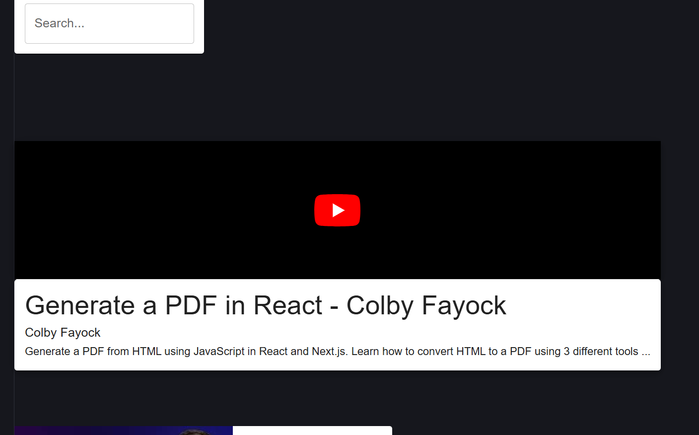
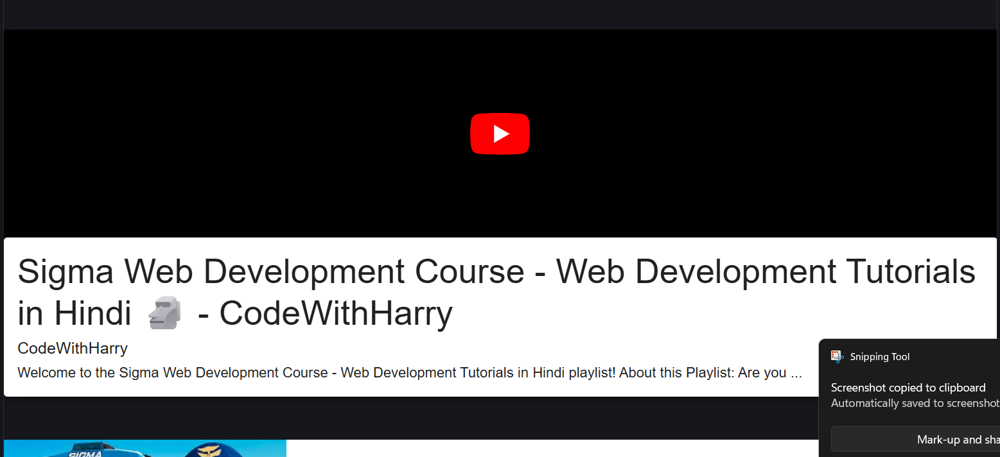

# 🎥 React YouTube Clone

A modern YouTube Clone built with React and YouTube Data API. This application allows users to search for videos, watch video content, and browse related videos through a clean and responsive user interface.

## 🚀 Features

* 🔍 Search YouTube videos
* 🎬 Watch videos directly in the application
* 📃 Display video details and descriptions
* 📱 Responsive user interface
* ⚡ Fast API integration using Axios
* 🎨 Material UI based design

## 🛠️ Tech Stack

### Frontend

* React.js
* JavaScript (ES6+)
* Material UI (MUI)
* Axios

### API

* YouTube Data API v3

## 📂 Project Structure

```bash
src/
│
├── components/
│   ├── SearchBar.jsx
│   ├── VideoList.jsx
│   ├── VideoItem.jsx
│   ├── VideoDetails.jsx
│   └── Youtube.jsx
│
├── App.jsx
├── main.jsx
└── index.css
```

## ⚙️ Installation

### Clone Repository

```bash
git clone https://github.com/khu1232/react-youtube-clone.git
```

### Navigate to Project Directory

```bash
cd react-youtube-clone/youtube
```

### Install Dependencies

```bash
npm install
```

### Start Development Server

```bash
npm run dev
```

### Build for Production

```bash
npm run build
```

## 🔑 API Configuration

Create a YouTube Data API key from Google Cloud Console.

Replace the API key in the project configuration file:

```javascript
key: "YOUR_YOUTUBE_API_KEY"
```

## 📸 Screenshots

## 📸 Screenshots

### Home Page



### Search Results


### Video Player



## 🎯 Learning Outcomes

Through this project I learned:

* React Components
* Props
* State Management
* React Lifecycle Methods
* API Integration with Axios
* Responsive UI Design
* Component-Based Architecture

## 🔮 Future Improvements

* Dark Mode
* Search History
* Watch Later Feature
* User Authentication
* Infinite Scrolling
* Context API State Management

## 👨‍💻 Author

**Komal Krothwal**

GitHub: https://github.com/khu1232

LinkedIn: Add Your LinkedIn Profile

## ⭐ Support

If you found this project useful, consider giving it a star on GitHub.


# React + Vite

This template provides a minimal setup to get React working in Vite with HMR and some ESLint rules.

Currently, two official plugins are available:

- [@vitejs/plugin-react](https://github.com/vitejs/vite-plugin-react/blob/main/packages/plugin-react) uses [Oxc](https://oxc.rs)
- [@vitejs/plugin-react-swc](https://github.com/vitejs/vite-plugin-react/blob/main/packages/plugin-react-swc) uses [SWC](https://swc.rs/)

## React Compiler

The React Compiler is not enabled on this template because of its impact on dev & build performances. To add it, see [this documentation](https://react.dev/learn/react-compiler/installation).

## Expanding the ESLint configuration

If you are developing a production application, we recommend using TypeScript with type-aware lint rules enabled. Check out the [TS template](https://github.com/vitejs/vite/tree/main/packages/create-vite/template-react-ts) for information on how to integrate TypeScript and [`typescript-eslint`](https://typescript-eslint.io) in your project.
